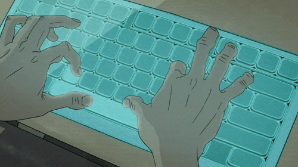

## Hiya! 🎋

I'm <strong>taptapdan</strong>, I'm a software engineer with 15 years of experience, and I'm currently using my coding super powers in EdTech.

### Tech I'm Using

   
  
  
  
  
  
  
  
  
  
  
  
  
  
  

### This Year's Progress

  <!--PROGRESS_START-->◽️◽️◽️◽️◽️◽️◽️◽️◽️◽️◽️◽️◽️◽️◽️◽️◽️◽️◽️◽️◽️◽️◽️◽️◽️👾◽️◽️◽️◽️ 88.08% complete<!--PROGRESS_END-->

  ....

  

  <em>On the other side of the screen, it all looks so easy.</em>

  ....

    <small><em><!--UPDATED_START-->Updated on Fri, 18 Nov 2022 12:02:32 GMT<!--UPDATED_END--></em></small>

